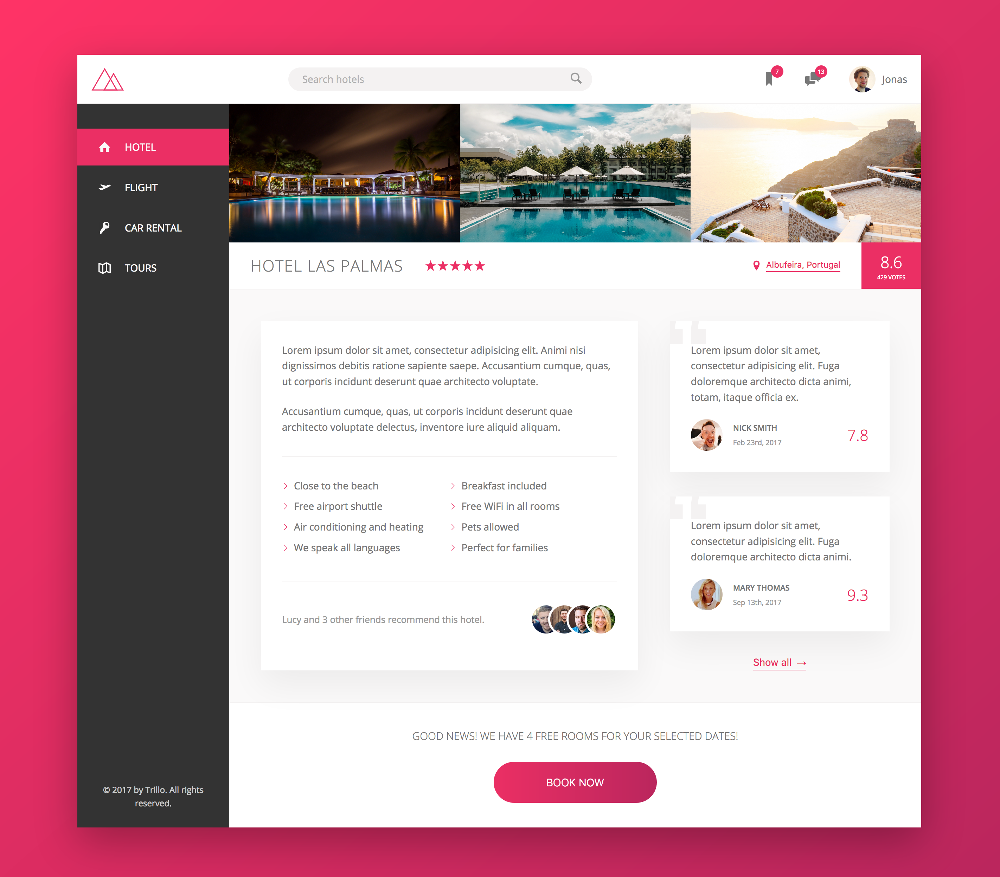

# Trillo App

Trillo is a fictional online booking app. The idea is that user can book hotel, flight, car rental and tours, all in one app. In this project, we won't dive in coding the functionalities of the app. Instead, we will focus on building the user interface, especially laying out the elements using Flexbox.

[View demo site here.](https://edwinchen85.github.io/trillo_app/)

